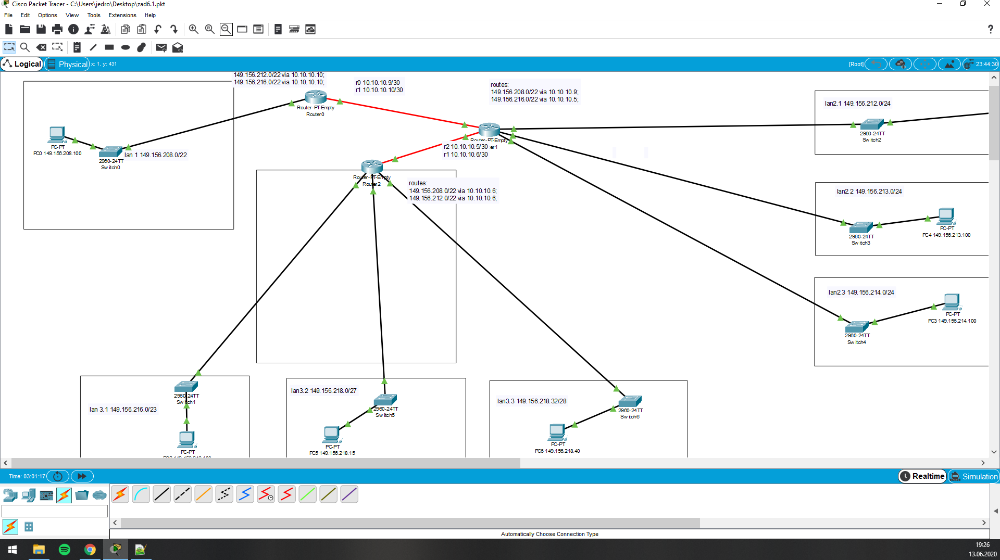

# Zadanie 2

Projekt sieci spełnił oczekiwania, organizacja po uwzględnieniu nowych wymogów chce podzielić dotychczasowe sieci na kilka podsieci.

1. Zaprojektuj oraz udokumentuj prototyp rozwiązania z wykorzystaniem oprogramowania ``CISCO Packet Tracer``, ``VirtualBox`` lub podobnego. 

## Schemat

## Charakterystyka
  * LAN 1 pozostaje bez zmian
  * LAN 2 zostaje podzielony na 3 równe podsieci
  * LAN 3 zostaje podzielony na 3 podsieci z uwzględnieniem
    * podsieć 1 ma obsłużyć do 512 hostów
    * podsieć 2 ma obsłużyć do 10 hostów
    * podsieć 3 ma obsłużyć do 32 hostów
  * Usunięty został również link pomiędzy Routerem (LAN 1) a Routerem (LAN 2)
  * Uwzględnij zmiany w tablicy routingów

## Zawartość

 * Adresy poszczególnych sieci IP
 * Adresację linków pomiędzy routerami
 * Tablice routingów na poszczególnych routerach
 
 
# MODYFIKACJA!
 podsieć 1 ma obsłużyć do **512** hostów
 powinno być **510**
 
 
| Siec   | Adres sieci | Host min     | Host max      | Adres rozgłoszeniowy |
| -------------     |:-------------: | -----:       | -----:        | -----:    |
|   LAN1       | 149.156.208.0 | 192.168.208.1   | 192.168.211.255 | 192.168.211.255  |
|   LAN2     | 149.156.212.0 |   192.168.212.1  | 192.168.215.255 | 192.168.215.255 |
|   LAN3   | 149.156.216.0 | 192.168.216.1 | 192.168.219.255| 192.168.219.255 |

LAN2

| Podsiec   | Adres podsieci | Host min     | Host max      | Adres rozgłoszeniowy |
| -------------     |:-------------: | -----:       | -----:        | -----:    |
|   LAN2.1       | 149.156.212.0 | 149.156.212.1   | 1149.156.212.254 | 149.156.212.255  |
|   LAN2.2    | 149.156.213.0 |   1149.156.213.1  | 149.156.213.254 | 149.156.213.255 |
|   LAN2.3   | 149.156.214.0 | 149.156.214.1 | 149.156.214.254 | 149.156.214.255 |
 
 LAN3

| Podsiec   | Adres podsieci | Host min     | Host max      | Adres rozgłoszeniowy |
| -------------     |:-------------: | -----:       | -----:        | -----:    |
|   LAN3.1       | 149.156.216.0 | 149.156.216.1   | 149.156.217.254 | 149.156.217.255  |
|   LAN3.2    | 149.156.218.0 |   149.156.218.1  | 149.156.218.30 | 149.156.218.31 |
|   LAN3.3   | 149.156.218.32 | 149.156.218.33 | 149.156.218.46 | 149.156.218.47 |

 
 
