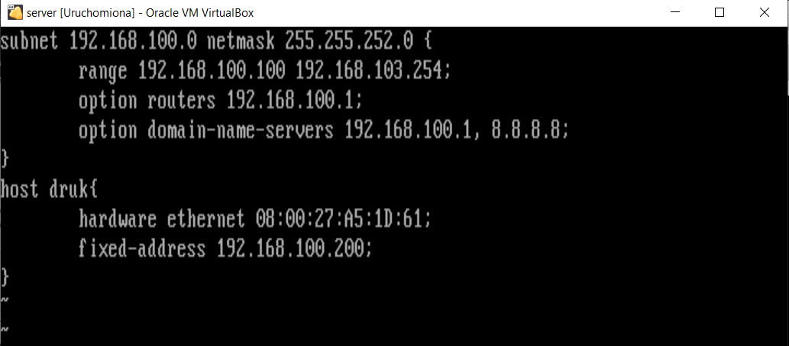
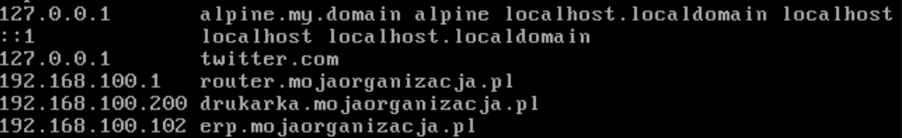
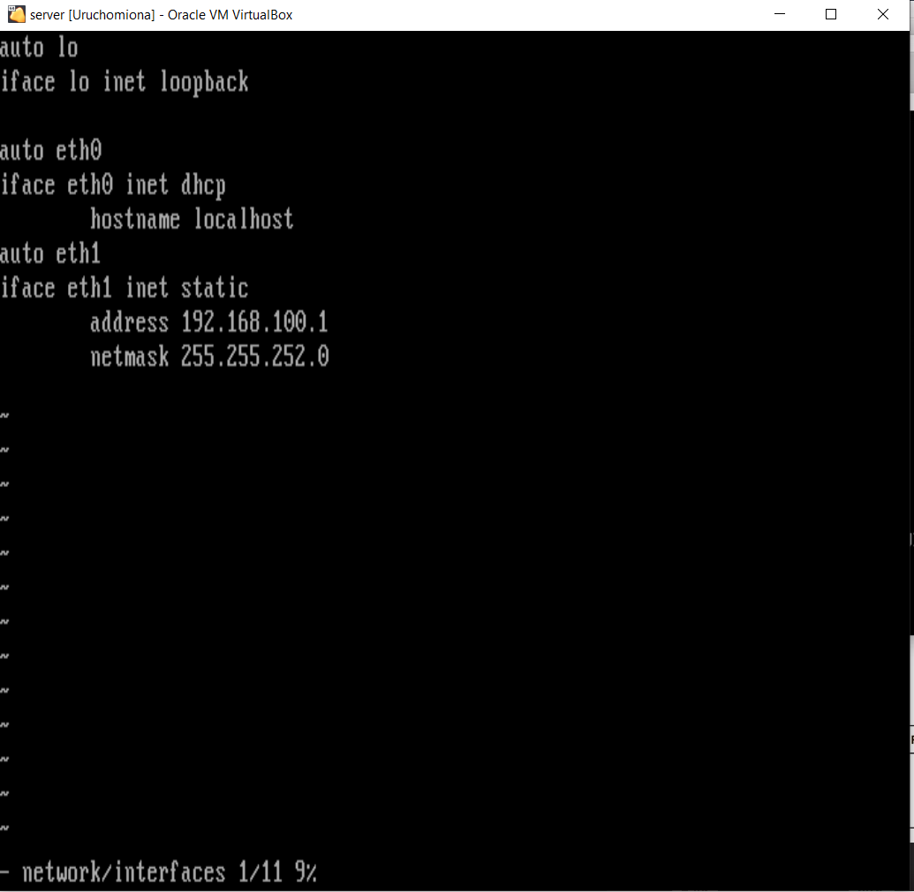

# Zadanie 1

Organizacja planuje ulepszyć działanie istniejącej sieci biurowej.

1. Zaprojektuj oraz udokumentuj konfigurację prototypu rozwiązania z wykorzystaniem oprogramowania ``VirtualBox`` lub podobnego. 

## Schemat

## Wymagania

W sieci pracują komputery biurowe oraz urządzenia siecowe współdzielące zasoby. Do tej pory organizacja borykała się z ręczna konfiguracją urządzeń oraz adresami IP które dla ludzi z poza kadry technicznej były niezrozumiałe. Postanowiono:

* Wykorzystać usługę DHCP do nadawania adresów w sposób automatyczny dla wszystkich stacji roboczych
* Serwer oraz durządzenia IP tj: drukarka muszą posiadać stałe adresy celem zminimalizowanai potrzeby rekonfiguracji ustawiań klientów
* Wprowadzić translację pomiędzy Adresami IP oraz nazwami domenowymi dla kluczowych zasobów
   - erp.mojaorganizacja.pl
   - drukarka.mojaorganizacja.pl
   - router.mojaorganizacja.pl
* Wszystkie urządzenia łączą się z siecią internet z wykorzystaniem bramy NAT
* Wykorzystać podsieć rozmiaru /22 pozwalającej zaadresować co najmniej 600 urządzeń

## Zawartość dokumentacji

 * Charakterystyka rozwiazania 
   użyto: server DHCP z funkcją routingu(oprogramowanie alpine dhcp) o adresie 192.168.100.1/22 . Przydziela on adresy zgodnie z pulą wymaganą w specyfikacji.
   Drukarka (maszyna wirtualna stały ip .200/22)
 * Adresy sieci IP
192.168.100.0- adres sieci 
255.255.252.0 -NETMASK
192.168.100.1 -host min
192.168.103.254 -host max
liczba hostów do zaadresowania 1022
COUNT
 * Oprogramowanie wykorzystane do realizacji poszczególnych wymagań
 serwer DHCP - dhcpd
serwer DNS - dnsmasq
brama NAT - iptables
 
 * Kluczowa konfiguracja oprogramowania pozwalająca na odtworzenie stanu po reinstalacji środowiska
    1. Konfiguracja NAT z iptables 
    komenda: iptables -t nat -A POSTROUTING -o eth0 -j MASQERADE
    2. Konfiguracja DHCP
    
    3. Konfiguracja DNS
    
    4. Konfiguracja interfejsów sieciowych
    maszyna komp i druk interfejs eth0 ustawiony na automat i dhcp
    
    ![zadanie 1]serv_ip.PNG)
    ![zadanie 1]komp_ip.PNG)
    ![zadanie 1]druk_ip.PNG)
    5. Inne jeżeli wykorzystane
    

